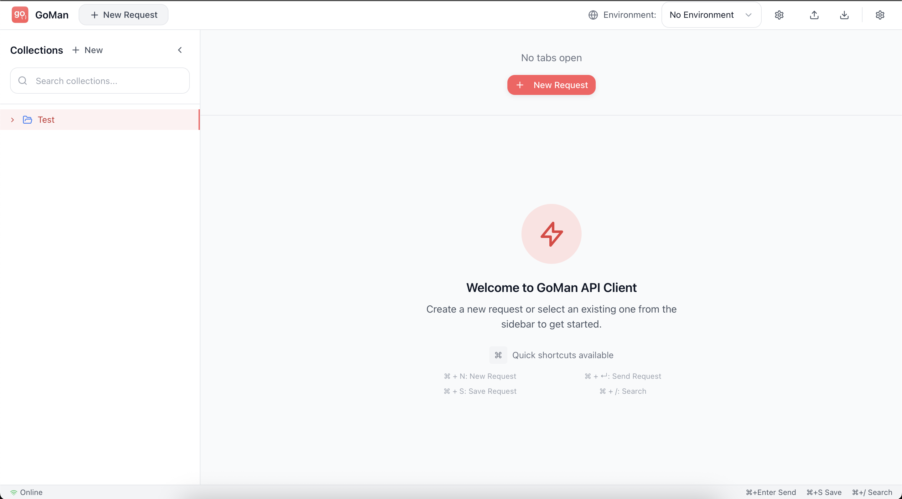
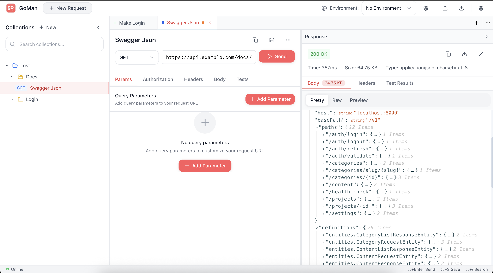
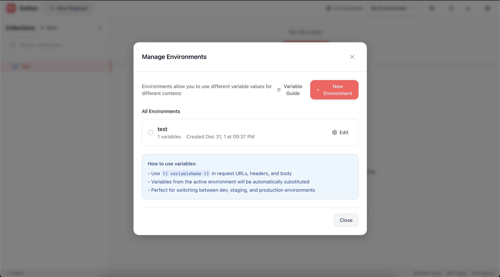
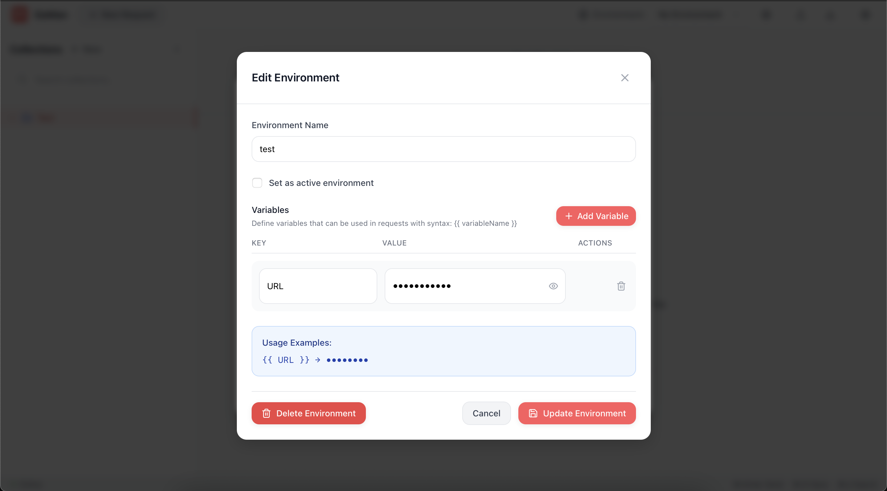

<div align="center">
  
  
  # GoMan
  
  ### 🚀 Modern API Client for Developers
  
  *A powerful, beautiful, and intuitive API testing tool built with Wails 3*
  
  [](https://wails.io)
  [](https://reactjs.org)
  [](https://www.typescriptlang.org)
  [](https://golang.org)
  
  [](https://github.com/RodolfoBonis/goman/releases)
  [](LICENSE)
  [](https://github.com/RodolfoBonis/goman/releases)
  
  
  
  <sub>🔥 <strong>Modern API Client</strong> • 🚀 <strong>Lightning Fast</strong> • 🎨 <strong>Beautiful Interface</strong> • 🔧 <strong>Environment Variables</strong></sub>
</div>

---

## 📚 Table of Contents

- [✨ Features](#-features)
- [🖼️ Screenshots](#️-screenshots)
- [🚀 Quick Start](#-quick-start)
- [🎯 Usage](#-usage)
- [🛠️ Development](#️-development)
- [🏗️ Built With](#️-built-with)
- [📄 License](#-license)
- [🤝 Support](#-support)

---

## ✨ Features

### 🎯 **Core Functionality**
- 🔥 **Lightning Fast**: Native performance with Go backend
- 📡 **HTTP Methods**: Full support for GET, POST, PUT, DELETE, PATCH, HEAD, OPTIONS
- 🎨 **Beautiful UI**: Modern, clean interface built with React and Tailwind CSS
- 📱 **Tab-based Interface**: Work with multiple requests simultaneously

### 🛠️ **Advanced Features**
- 🌍 **Environment Management**: Create and switch between different environments
- 🔧 **Variable Substitution**: Use `{{variables}}` in URLs, headers, and body
- 📁 **Collections & Folders**: Organize requests in hierarchical structure
- 💾 **Auto-save**: Never lose your work with automatic persistence
- 🎪 **Response Viewer**: Pretty JSON formatting, raw view, and preview modes
- 📊 **Response Details**: View headers, status, time, and size information

### 🚀 **Developer Experience**
- ⚡ **Real-time Updates**: Hot-reload during development
- 🔍 **Smart Search**: Find requests and collections quickly
- 📋 **Request Duplication**: Clone requests for quick testing variations
- 🎛️ **Resizable Panels**: Customize your workspace layout
- 🌙 **Collapsible Interface**: Focus on what matters

---

## 🖼️ Screenshots

### 🏠 Main Interface
<div align="center">
  
  <p><em>Clean and modern interface with tab-based navigation</em></p>
</div>

### 📡 Request Testing
<div align="center">
  
  <p><em>Powerful request builder with real-time variable substitution</em></p>
</div>

### 🌍 Environment Management
<div align="center">
  
  <p><em>Manage multiple environments with ease</em></p>
</div>

<div align="center">
  
  <p><em>Create and edit environment variables with preview</em></p>
</div>

---

## 🚀 Quick Start

### Prerequisites

- **macOS 10.15+** (currently supported)
- **Go 1.21+** (for development)
- **Node.js 18+** (for frontend development)

### Installation

#### Option 1: Download Release (Recommended)
1. Go to [Releases](https://github.com/RodolfoBonis/goman/releases)
2. Download `GoMan-1.0.0.dmg`
3. Open the DMG and drag GoMan to Applications
4. Launch GoMan from Applications

#### Option 2: Build from Source
```bash
# Clone the repository
git clone https://github.com/RodolfoBonis/goman.git
cd goman

# Install frontend dependencies
cd frontend && npm install && cd ..

# Run in development mode
wails3 dev

# Or build for production
wails3 task darwin:package
```

---

## 🎯 Usage

### Creating Your First Request
1. **New Request**: Click "New Request" or use `Cmd+N`
2. **Set Method**: Choose HTTP method (GET, POST, etc.)
3. **Enter URL**: Type your API endpoint
4. **Add Headers**: Use the Headers tab for authentication, content-type, etc.
5. **Request Body**: Add JSON, XML, or form data in the Body tab
6. **Send**: Hit the Send button or `Cmd+Enter`

### Environment Variables
```json
{
  "API_BASE": "https://api.example.com",
  "AUTH_TOKEN": "your-secret-token",
  "VERSION": "v1"
}
```

Use in requests:
- URL: `{{API_BASE}}/{{VERSION}}/users`
- Headers: `Authorization: Bearer {{AUTH_TOKEN}}`

### Collections & Organization
- **Create Collection**: Group related requests
- **Add Folders**: Organize requests hierarchically
- **Link Environment**: Auto-activate environment per collection
- **Search**: Find requests across all collections

---

## 🛠️ Development

### Project Structure
```
goman/
├── frontend/           # React TypeScript frontend
│   ├── src/
│   │   ├── components/ # UI components
│   │   ├── store/      # Zustand state management
│   │   ├── utils/      # Utility functions
│   │   └── types/      # TypeScript definitions
│   └── public/         # Static assets
├── backend/            # Go backend services
├── build/              # Build configuration and assets
├── bin/                # Compiled binaries
└── dist/               # Distribution packages
```

### Development Commands
```bash
# Start development server (with hot-reload)
wails3 dev

# Build for development
wails3 task build

# Build for production (macOS)
wails3 task darwin:package

# Run tests
go test ./...
cd frontend && npm test

# Lint code
golangci-lint run
cd frontend && npm run lint
```

### Contributing
1. Fork the repository
2. Create a feature branch: `git checkout -b feature/amazing-feature`
3. Commit changes: `git commit -m 'Add amazing feature'`
4. Push to branch: `git push origin feature/amazing-feature`
5. Open a Pull Request

---

## 🏗️ Built With

### Backend
- **[Go](https://golang.org)** - Fast, reliable, and efficient backend
- **[Wails 3](https://wails.io)** - Go + Web frontend framework
- **SQLite** - Lightweight database for data persistence

### Frontend
- **[React 18](https://reactjs.org)** - Modern UI library
- **[TypeScript](https://www.typescriptlang.org)** - Type-safe JavaScript
- **[Tailwind CSS](https://tailwindcss.com)** - Utility-first CSS framework
- **[Zustand](https://github.com/pmndrs/zustand)** - Lightweight state management
- **[Monaco Editor](https://microsoft.github.io/monaco-editor/)** - VS Code editor for request bodies
- **[Lucide React](https://lucide.dev)** - Beautiful icon library

### Tools & Build
- **[Vite](https://vitejs.dev)** - Fast frontend build tool
- **[Task](https://taskfile.dev)** - Task runner for build automation

---

## 📄 License

This project is licensed under the MIT License - see the [LICENSE](LICENSE) file for details.

---

## 🤝 Support

- 📧 **Email**: [dev@rodolfodebonis.com.br](mailto:dev@rodolfodebonis.com.br)
- 🐛 **Issues**: [GitHub Issues](https://github.com/RodolfoBonis/goman/issues)
- 💬 **Discussions**: [GitHub Discussions](https://github.com/RodolfoBonis/goman/discussions)

---

## ⭐ Acknowledgments

- Built with ❤️ using [Wails 3](https://wails.io)
- Inspired by tools like Postman, Insomnia, and Thunder Client
- Icons and design inspired by modern developer tools

---

## 📈 Project Status

**Current Version**: 1.0.0 🚀  
**Status**: ✅ Active Development  
**Platform**: 🍎 macOS (Windows & Linux coming soon)  
**Last Updated**: January 2025

---

<div align="center">
  <p>Made with ❤️ by <a href="https://github.com/RodolfoBonis">RodolfoBonis</a></p>
  
  <p>If you found this project helpful, please consider giving it a ⭐</p>
  
  <p><sub>💡 <strong>Tip:</strong> This README showcases 4 high-quality screenshots (1.6MB total) demonstrating all key features</sub></p>
</div>
